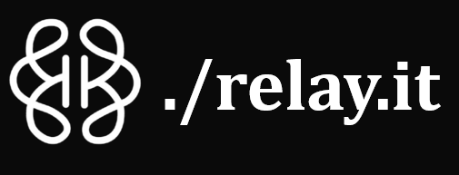
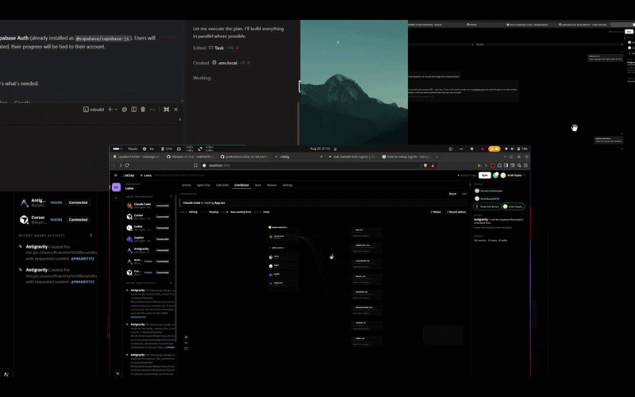

<div align="center">



### GitHub Desktop for AI agents.

*Git coordinates humans committing minutes apart. **Relay coordinates agents editing the same files right now** — file locks, dependency-aware locks, live patch sync, and one shared board.*

**Twelve agents on one repo, and none of them blind to the others.**

[**📖 Read the Documentation**]((https://relay-brain.vercel.app/docs.html))

<br/>

<a href="https://nodejs.org"></a>
<a href="LICENSE"></a>


<br/>
<br/>

**Works with**

<p align="center">
  
  
  
  <br />
  
  
</p>

</div>

---

## The problem

Eighteen months ago you had **one** coding assistant. Today you probably have **three running at once** — Claude in one terminal, Cursor in another, Copilot in the editor. They all write to the same files, and not one of them knows the others exist.

Now put **four people** on that repo. That's **twelve agents**, editing the same code, blind to each other. You find out at the merge. Or you don't find out at all.

Git solved this for humans — but Git assumes people committing at human speed, minutes apart, one branch each. **Agents write at machine speed, in parallel, in the same directory.** There is no layer for that.

## The fix

```diff
- 12 agents · 12 blind writers · conflicts discovered at merge
+ 12 agents · 1 lock table · conflicts prevented at the edit
```

Relay sits under every agent as a **coordination layer**. Pre-tool hooks claim a lock before an agent writes; post-tool hooks release it. If one agent is modifying a component, another **cannot silently overwrite** those changes.

> **One host, no backend.** One person runs `relay serve` — that machine *is* the server. Everyone else connects over an ngrok tunnel, straight to that laptop. Nothing lives on infrastructure you do not own.

<div align="center">



</div>

---

## The four pillars

| | What it does |
|---|---|
| 🔒 **File locking** | Every agent write goes through a claim/release cycle against a shared lock table (TTL-based, auto-expiring). Destructive overwrites are blocked, not detected after the fact. |
| 🕸️ **Dependency-graph locking** | Files do not exist independently — one change can affect dozens. Relay parses imports with tree-sitter and asks *"does this change affect files another agent is working on?"*, not just *"is this exact file locked?"* Agents stay parallel; the blast radius stays safe. |
| 📡 **Patch sync across machines** | Your teammate has their own filesystem, environment, and agents. Relay propagates **patches**, not whole-project copies — `relay push` / `relay pull` keep every clone on the same working state. |
| 🖥️ **Mission Control** | One board for every agent on every machine: live lock table, lock graph, code edits, unified agent chat history, conflicts, presence. |

---

## Quick start

**Host** — the machine everyone else connects to:

```bash
relay login              # GitHub identity (uses the gh CLI)
relay clone <repo-url>   # clone + register workspace + install agent hooks
relay serve              # API → 127.0.0.1:3001 · Mission Control → :3002
```

Then open Mission Control → **Team → Share** to mint the ngrok invite link.

**Teammate:**

```bash
relay serve              # their own local relay
# join with the host's invite link on the Team tab
relay pull               # take the host's current working state
```

Now start agents as usual. Hooks claim and release locks automatically — nobody has to remember a command.

<details>
<summary><strong>Install options</strong></summary>

<br/>

| Method | Command |
|--------|---------|
| local dev | `npm i`, then `npm link` in this repo |
| attach an existing repo | `relay add /path/to/repo` |
| fresh clone | `relay clone <url> [dir]` |

Requires **Node.js 18+** (20+ recommended). No database, no hosted backend, no login server.

</details>

---

## How it works

```text
  Cursor ──┐  pre-tool hook: claim
  Claude ──┤  post-tool hook: release      ┌──────────────┐
  Copilot ─┼──► lock table ◄── dep graph ──│ relay serve  │──► Mission Control
  Codex ───┤        ▲                      │  (your host) │          ▲
  Antigravity ┘     │                      └──────┬───────┘          │
                    │       ngrok tunnel          │                  │
              teammate's relay ◄──── patches ─────┴──────────────────┘
```

| Layer | Who runs it | What it guards |
|-------|-------------|----------------|
| **Claim / release** | pre- and post-tool hooks | exclusive write access to a file |
| **Dependency graph** | tree-sitter import scan | files *affected by* the edit, not just the edit |
| **Room** | `relay serve` + ngrok tunnel | one shared lock table across machines |
| **Patches** | `relay push` / `relay pull` | working-tree state without full copies |
| **Board** | Mission Control (:3002) | who holds what, right now |

> Locks and the board are separate subsystems — hooks arbitrate straight against the host, while the board is fed by a mirror. `relay doctor` walks that chain and tells you which link is broken.

---

## Commands

| Command | Description |
|---------|-------------|
| `relay login` / `logout` / `whoami` | GitHub identity (via `gh` CLI, or device flow with `GITHUB_CLIENT_ID`) |
| `relay clone <url> [dir]` | git clone + register workspace + install agent hooks |
| `relay add <path>` | Attach an existing local repo |
| `relay serve` | API on `127.0.0.1:3001` + Mission Control on `:3002` |
| `relay serve --no-ui` | API + coordinator only |
| `relay push` | Send your dirty working-tree files to the shared room |
| `relay pull` | Apply the host's current dirty files onto this clone |
| `relay status` | Health check (room, role, host, ports) |
| `relay mcp-url` | Print the MCP config for this room's shared-context endpoint |
| `relay doctor` | Diagnose an empty Coordinator board |

---

## Mission Control

Started by `relay serve` — runs on your own machine, no hosted account.

| | URL |
|---|-----|
| Dashboard | http://localhost:3002 |
| API | http://127.0.0.1:3001/api/health |

**File locks panel** · **lock graph canvas** · **code edits** · **agent session chat** · **activity timeline** · **team and room presence** · **conflict notices**.

---

## MCP — shared room context

Any MCP client can read the room's context, **even on a machine with no relay installed**:

```bash
relay mcp-url    # prints a ready-to-paste mcpServers block
```

Coordination tools (`relay_claim_file`, `relay_release_file`, `relay_status`) run against each member's own local relay. The room endpoint is **read-only** for anyone off the host machine.

<details>
<summary><strong>Tools exposed</strong></summary>

<br/>

| Tool | Purpose |
|------|---------|
| `relay_claim_file` | Acquire an exclusive write lock before editing |
| `relay_release_file` | Release the lock after editing |
| `relay_status` | View the full lock table |
| `relay_get_conflicts` | Overlapping edits in the last 5 minutes |
| `relay_get_recent_changes` | Recent `code_edit` events |
| `relay_get_chat_history` | Unified agent chat across every room member |
| `relay_report_change` | Push a code-change event |
| `relay_report_decision` / `relay_get_decisions` | Append / read decisions |
| `relay_update_task` / `relay_get_active_tasks` | Append / read tasks |
| `relay_get_project_context` | Full JSON project context |
| `relay_sync` | Re-read agent transcripts into unified history |

</details>

---

## 🪝 Hooks

`relay clone` / `relay add` install pre-tool (**claim**), post-tool (**release**), pre-read, and stop hooks into your project:

| Agent | Config | Write tools intercepted |
|-------|--------|-------------------------|
| Claude Code | `.claude/settings.json` | `Edit`, `Write`, `NotebookEdit` |
| Cursor | `.cursor/hooks.json` | `Write`, `Edit`, `Delete` |
| Codex | `.codex/hooks.json` | `apply_patch`, `Edit`, `Write` |
| Copilot CLI | `.github/hooks/relay-os.json` | `edit`, `create` |
| Antigravity | `.agents/hooks.json` | `write_to_file`, `replace_file_content`, `multi_replace_file_content` |

Languages parsed for the dependency graph: TypeScript/JavaScript, Python, Go, Rust, Java, C#, C/C++, PHP, Ruby.

---

## Dependencies

| | |
|---|---|
| ✅ **Required** | Node.js 18+ (20+ recommended), npm |
| ⚙️ **Bundled** | `express`, `cors`, `ws`, `@vscode/tree-sitter-wasm` · `next`, `react` (Mission Control) |
| 🚫 **Not needed** | MongoDB, Redis, Docker, a hosted backend, an account |
| 🧩 **Optional** | `gh` CLI for `relay login` · ngrok for cross-machine rooms |

**Env vars:** `RELAY_PORT` (3001) · `RELAY_UI_PORT` (3002) · `RELAY_UI_ORIGIN`

---

## Roadmap

- **Git worktree isolation** — every agent in its own workspace off the same repository, free to experiment and test independently, integrated back into main when the work is ready.
- Richer conflict resolution on top of the existing OT / patch layer.

---

<div align="center">

**We used Relay to build Relay.** The problem we were solving was the problem we were having.

The next time you build a hackathon project, do not just add more agents. **Just relay.it**

<sub>MIT licensed · Your machine is the server.</sub>

</div>
